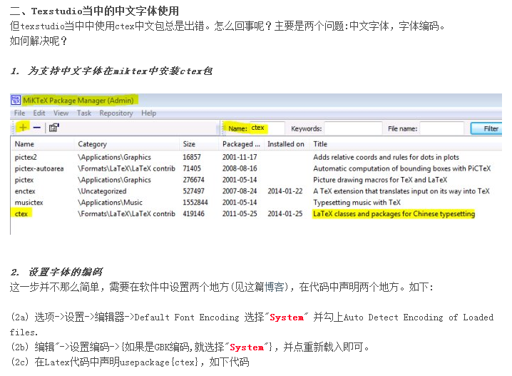

[toc]

## 中文配置



```latex
\documentclass[10pt,a4paper]{article}
\usepackage{ctex}
\begin{document}
good morning!\\
中文English中文
\end{document}
```

## 主题配置

选项/加载配置文件，  选择 `.txsprofile` 文件，重新打开，配置才会生效。
