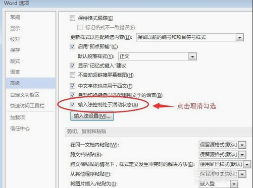

[toc]

## 快捷键

+ `Ctrl+E`  居中
+ `鼠标拖动+ALT`，微调标尺
+ `ctrl+alt+enter`，输入格式分隔符

## 中英文字号对应关系

1磅＝0.3527mm

## 导出高清PDF

用 打印 选项，打印到 福昕 阅读器

## 参考文献的引用

- 文章结尾粘贴好参考文献，【段落】—>【编号】，创建编号列表（可设置自己需要的格式）
- 正文中需要引用的地方，【引用】—>【交叉引用】，【引用类型】：编号项，【引用内容】：段落编号。如选择【插入为超链接】，则可实现跳转功能。
- 连续引用的编号，如[3][4][5]，想改为[3-5]，可利用【字体】->【隐藏】功能。

## Mathtype

### 报错

`此对象创建于Equation中，此应用程序不能用来打开`

文件->选项->加载项->最下方有COM加载项
点击转到->添加->c:\program files\common files\microsoft shared\EQUATION\EQNEDT32
然后等你的电脑卡1分钟左右即可

### 公式显示不完整

“段落”“行距”为固定值所致

### 交叉引用

先将公式编号 回车 到下一行，然后在公式一行末尾ctrl+alt+enter，输入 格式分隔符  用于交叉引用

## 更新域

全选，F9，可更新域，公式编号等可用

## 输入法在word中失效

